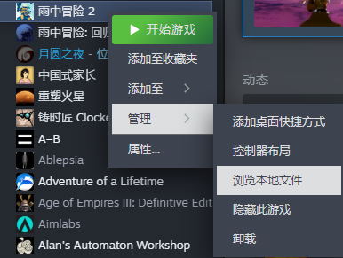

最近沉迷雨中冒险2，然后看了一次视频发现别人玩的时候捡道具的显示为什么都那么详细呢，于是我就去找了一下相关的mod。  

然后发现原来只是简单的改语言文件就可以了。  

考虑到刚有一个大版本更新，多了不少道具原来的语言文件覆盖了可能会炸，于是就自己动手丰衣足食啦。  

语言文件的目录位于

> {steam}\steamapps\common\Risk of Rain 2_Data\StreamingAssets\Language\zh-CN

可以直接在steam库内右键 - 管理 - 来浏览本地文件找到



下面的json文件就是了，以及有一个txt文件目测可以用来修改字体。

打开那个json之后，**正则替换执行下面的正则表达式**即可。

**注意空格什么的一定要对，替换完之后要注意观察跟原来有没有不同，比如逗号后面多空格也会导致载入失败。**

## 全都换掉

```plain
  "(ITEM|EQUIPMENT)_([A-Z]+)_PICKUP" : "(.+)",\n  "[A-Z]+_([A-Z]+)_DESC" : "(.+)",
```

正则替换为

```plain
    "$1_$2_PICKUP" : "$5",\n  "$1_$4_DESC" : "$5",
```

## 单独替换的正则表达式

### 被动道具的描述

```plain
  "ITEM_([A-Z]+)_PICKUP" : "(.+)",\n  "ITEM_([A-Z]+)_DESC" : "(.+)",
```

正则替换为

```plain
  "ITEM_$1_PICKUP" : "$4",\n  "ITEM_$3_DESC" : "$4",
```

### 主动装备的描述

```plain
  "EQUIPMENT_([A-Z]+)_PICKUP" : "(.+)",\n  "EQUIPMENT_([A-Z]+)_DESC" : "(.+)",
```

正则替换为

```plain
  "EQUIPMENT_$1_PICKUP" : "$4",\n  "EQUIPMENT_$3_DESC" : "$4",
```
